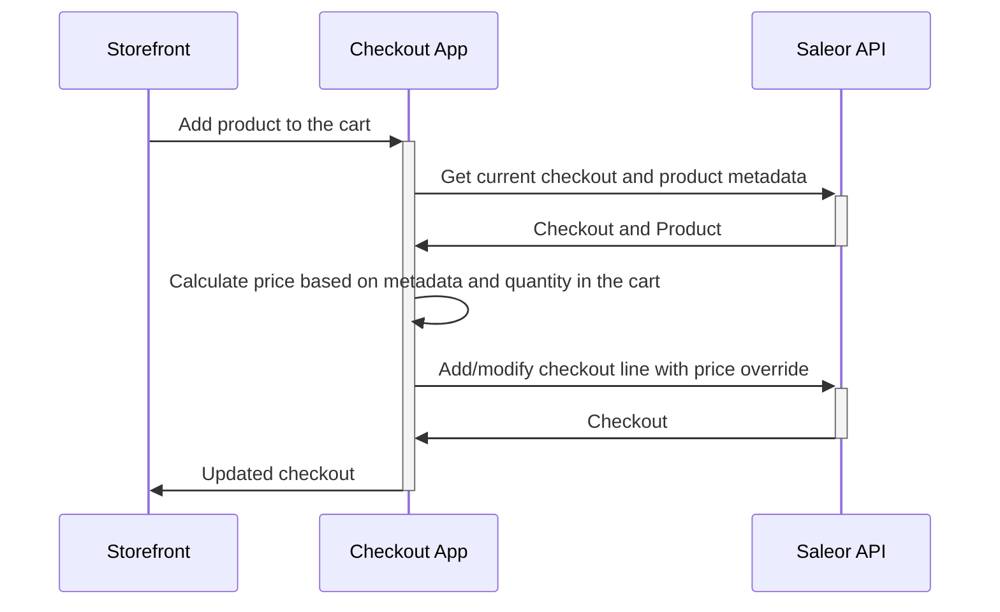

<div align="center">
  <h1>Saleor App Template - Custom pricing based on quantity</h1>
</div>

## Description

- Example uses Public Metadata to store quantity based pricing for the products. 
- The app works as a proxy on Add to cart request
  - It takes pricing from the metadata
  - Based on quantity in the cart, it chooses a proper pricing
  - Add lines mutation use calculated price to override base price of the item. To perform such operation, the app require `HANDLE_CHECKOUTS` permission
- The app has example price management view in the Dashboard

### Data flow during adding item to the cart



## Development

### Requirements

Before you start, make sure you have installed:

- [Node.js](https://nodejs.org/en/)
- [pnpm](https://pnpm.io/)

### Starting

1. Install the dependencies by running:

```
pnpm install
```

2. Set environment variables. Rename `.env.example` to `.env.local` and provide URL to the API and channel 

3. Start the local server with:

```
pnpm dev
```

4. Expose local environment using tunnel:
Use tunneling tools like [localtunnel](https://github.com/localtunnel/localtunnel) or [ngrok](https://ngrok.com/).

5. Install the application in your dashboard:

If you use Saleor Cloud or your local server is exposed, you can install your app by following this link:

```
[YOUR_SALEOR_DASHBOARD_URL]/apps/install?manifestUrl=[YOUR_APP_TUNNEL_MANIFEST_URL]
```

This template host manifest at `/api/manifest`

Follow the guide [how to install your app](https://docs.saleor.io/docs/3.x/developer/extending/apps/installing-apps#installation-using-graphql-api) to learn more.

## Usage

1. Define quantity based prices:
  - go to Saleor Dashboard, Apps tab and open `Saleor App Checkout Prices POC`
  - list of 10 first variants will be displayed
  - set new prices for 5 and 10 pcs. Click on save
  - data are now stored in the product metadata
2. Open "storefront" page:
  - `http://localhost:3000/storefront`
  - choose updated variant
  - add to checkout and see how prices change based on added amount of the items
