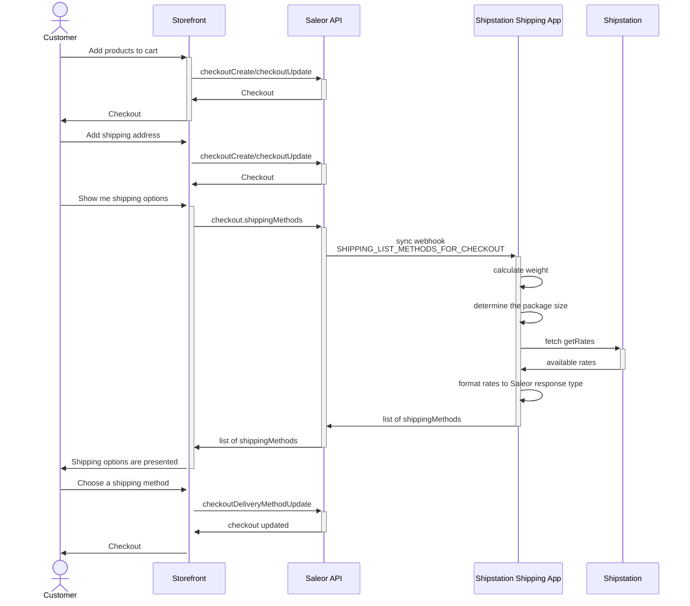

<div align="center">

</img>
</div>

<div align="center">
  <h1>Example Shipping App x Shipstation</h1>
</div>

<div align="center">
  <p>Example app that connects to third-party Shipping API and works with Saleor.</p>
</div>

<div align="center">
  <a href="https://saleor.io/">Website</a>
  <span> | </span>
  <a href="https://docs.saleor.io/">Docs</a>
</div>

## Introduction

This app is an example of how to integrate with the Saleor shipping API. The diagram below illustrates the flow of requests:



#### Determining the weight of the package

The weight is the sum of of all of the items weights (`CheckoutLine.variant.weight`) and supports grams, ounces and pounds.

#### Determining the size of the package

Example code is assuming 3 types of available packages:
- envelope
- small box
- big box

The types and their sizes are defined in `/src/modules/shipstation/types.ts`.

When shipping methods are requested, the App checks the value of Product attribute with slug "package-size", and chooses which package will fit whole checkout. Eg.: 
- Checkout contains 2 "envelope" sized items. Since it's below limit of the "envelope" package (5pcs), "envelope" will be used.
- Checkout contains 2 "envelope" and 1 "big box". The only package which can fit all the products will be "big box"

Code can be found in file `/src/modules/shipstation/saleor-to-shipstation.ts`.


### Subscriptions

#### ShippingListMethodsForCheckout

You can use the third-party API to request shipping methods for a given checkout session. Since a checkout can be created with or without a shipping address, you may need additional logic for these two scenarios. For more information, refer to the [documentation](https://docs.saleor.io/docs/3.x/api-reference/checkout/objects/shipping-list-methods-for-checkout).

#### OrderCreated

Placeholder webhook which can be used to notify service responsible for preparing shipping labels. [Docs](https://docs.saleor.io/docs/3.x/api-reference/orders/objects/order-created)

### Mutations

Standard flow for storefront:

1. `checkoutCreate`. Creates checkout with shipping address.
2. `checkoutDeliveryMethodUpdate`. Select delivery method.
3. `checkoutComplete`. Completes checkout and creates an order.

### How to test whole flow?

1. Run app in [development](#development) mode
2. Send requests via [Bruno](#running-bruno)

## Development

### Requirements

Before you start, make sure you have installed:

- [Node.js](https://nodejs.org/en/)
- [pnpm](https://pnpm.io/)
- [Bruno](https://www.usebruno.com/) - for API calls

1. Install the dependencies by running:

```
pnpm install
```

2. Start the local server with:

```
pnpm dev
```

3. Expose local environment using tunnel:
   Use tunneling tools like [localtunnel](https://github.com/localtunnel/localtunnel) or [ngrok](https://ngrok.com/).

4. Create .env file with URL of the exposed app and required API keys (reference in `.env.example`)

5. Install the application in your dashboard:

If you use Saleor Cloud or your local server is exposed, you can install your app by following this link:

```
[YOUR_SALEOR_DASHBOARD_URL]/apps/install?manifestUrl=[YOUR_APP_TUNNEL_MANIFEST_URL]
```

This template host manifest at `/api/manifest`

You can also install application using GQL or command line. Follow the guide [how to install your app](https://docs.saleor.io/docs/3.x/developer/extending/apps/installing-apps#installation-using-graphql-api) to learn more.

### Generated schema and typings

Commands `build` and `dev` would generate schema and typed functions using Saleor's GraphQL endpoint. Commit the `generated` folder to your repo as they are necessary for queries and keeping track of the schema changes.

[Learn more](https://www.graphql-code-generator.com/) about GraphQL code generation.

### Storing registration data - APL

During the registration process, Saleor API passes the auth token to the app. With this token App can query Saleor API with privileged access (depending on requested permissions during the installation).
To store this data, app-template use a different [APL interfaces](https://github.com/saleor/saleor-app-sdk/blob/main/docs/apl.md).

The choice of the APL is made using the `APL` environment variable. If the value is not set, FileAPL is used. Available choices:

- `file`: no additional setup is required. Good choice for local development. It can't be used for multi tenant-apps or be deployed (not intended for production)
- `upstash`: use [Upstash](https://upstash.com/) Redis as storage method. Free account required. It can be used for development and production and supports multi-tenancy. Requires `UPSTASH_URL` and `UPSTASH_TOKEN` environment variables to be set

If you want to use your own database, you can implement your own APL. [Check the documentation to read more.](https://github.com/saleor/saleor-app-sdk/blob/main/docs/apl.md)

### Running Bruno

If you have your application up and running inside Saleor Dashboard now its time to run GraphQL mutations. To get started you need:

1. Create `.env` inside `bruno` folder based on `.env.example`
2. Fill the needed env variables
3. Open Bruno and send request in sequence they are defined to make full checkout flow

### Limitations

- carriers list (eg. stamps_com, ups) is hardcoded in the envs, and at the moment only one is supported
- all saleor variants have to follow the same weight unit
- the app assumes the shipping rates returned from the Shipstation are using USD as currency - channel configuration should follow this format
- considering SLIM shipstation rate limits (40 req/s) mitigation measures should be taken
  - aggressive caching (based on postalCodes and checkout weight)
  - contacting Shipstation to modify the limits
