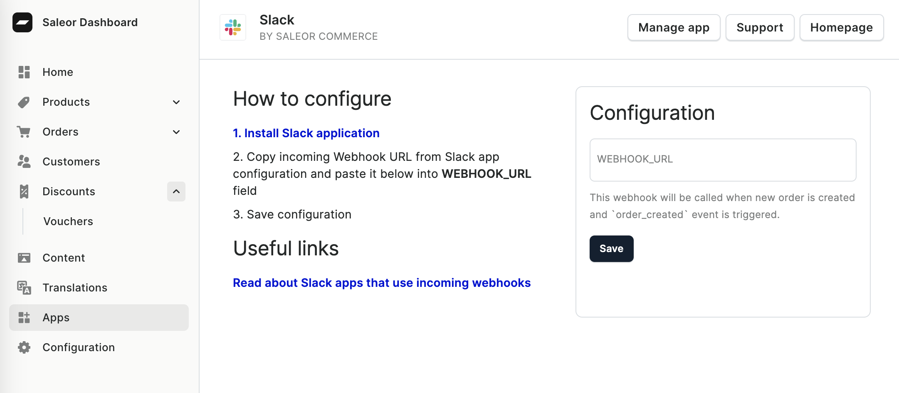

# Saleor App Example: Slack integration

Note: This repository is an example, which means:
- It's not production ready
- It's not actively maintained by Saleor
- It should be used as a learning resource

Saleor application to send Slack messages based on `order_created` events.

### What's included?

- Connection between Saleor and Slack using webhook
- Example `order_created` webhook that triggers Slack bot to send message

### The stack

Slack app is based on App Template - you can check it [here](https://github.com/saleor/saleor-app-template)

## How to use this project

### Select your APL

If you want to develop single tenant application - use already configured `FileAPL` for local development.

If you need to support multiple tenants application or you want to deploy your application - use `UpstashAPL`. Follow [How to configure Upstash](docs/upstash.md) for more info.

To read more about storing auth data, read the [APL documentation](https://github.com/saleor/saleor-app-sdk/blob/main/docs/apl.md)

### Generated schema and typings

Commands `build` and `dev` would generate schema and typed functions using Saleor's GraphQL endpoint. Commit `generated` folder to your repo as they are necessary for queries and keeping track of the schema changes.

[Learn more](https://www.graphql-code-generator.com/) about GraphQL code generation.

### Learn more about Saleor Apps

[Apps guide](https://docs.saleor.io/docs/3.x/developer/extending/apps/key-concepts)

[Configuring apps in dashboard](https://docs.saleor.io/docs/3.x/dashboard/apps)
